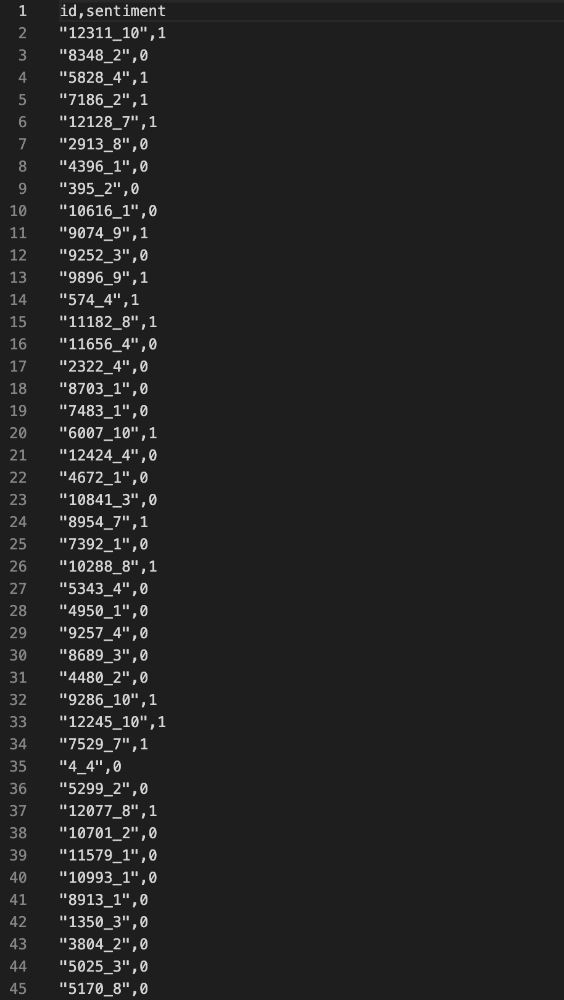

# Movie_reviewer
A machine learning based movie reviwing script that reads on to a movie review and recommends if it is good to see.
## Link To Dataset
labeledTrainData.tsv
https://www.kaggle.com/c/word2vec-nlp-tutorial/download/labeledTrainData.tsv.zip
TestData.tsv
https://www.kaggle.com/c/word2vec-nlp-tutorial/download/testData.tsv.zip
## Installation:
1)Install Dependencies

2)Change to the parent directory where the code is stored

3)Run the Notebook
## Output
The result can be found in a csv file Bag_of_Words_model.csv

